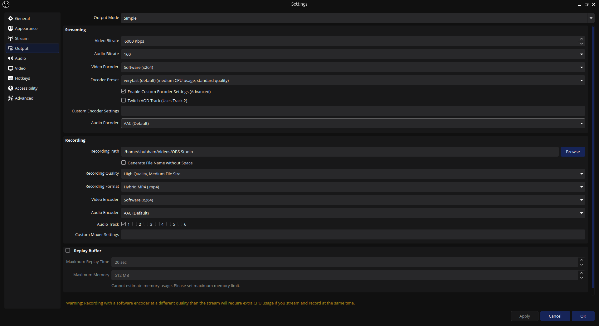

# OBS Studio Installation Guide for Ubuntu 24.04

A comprehensive guide to install OBS Studio with PipeWire audio support on Ubuntu 24.04 LTS for professional video recording with stable audio and video capture.

## Part 1: System Update

Before installation, ensure your system is up to date.

```bash
sudo apt update
sudo apt upgrade -y
```

## Part 2: Install PipeWire Audio Server

PipeWire is the modern audio and video server that provides superior audio handling compared to PulseAudio.

### Install Core PipeWire Components

```bash
sudo apt install pipewire pipewire-pulse pipewire-alsa -y
```

This installs:

- pipewire: Core audio/video server
- pipewire-pulse: PulseAudio compatibility layer for backward compatibility
- pipewire-alsa: ALSA (Advanced Linux Sound Architecture) compatibility

### Install WirePlumber (Session Manager)

WirePlumber manages the PipeWire session and handles audio device routing.

```bash
sudo apt install wireplumber -y
```

### Enable PipeWire Services

Enable the services to start automatically at boot and start them immediately.

```bash
systemctl --user start pipewire
systemctl --user start pipewire-pulse
systemctl --user start wireplumber
systemctl --user enable pipewire pipewire-pulse wireplumber
```

### Verify PipeWire is Running

Check that all services are active and running.

```bash
systemctl --user status pipewire
systemctl --user status pipewire-pulse
systemctl --user status wireplumber
```

> [!TIP]
> All three should show "active (running)". Any warnings about libcamera or portal permissions are non-critical and do not affect recording.

## Part 3: Install x264 Video Encoder

The x264 encoder is required for software-based video encoding. This is the most compatible and stable encoder for Ubuntu.

```bash
sudo apt install libx264-164 x264 -y
```

## Part 4: Install OBS Studio

### Add Official OBS Studio PPA

Add the official OBS Project repository for the latest version.

```bash
sudo add-apt-repository ppa:obsproject/obs-studio
sudo apt update
```

### Install OBS Studio and FFmpeg

Install OBS Studio along with FFmpeg for video processing and codec support.

```bash
sudo apt install obs-studio ffmpeg -y
```

### Launch OBS Studio

Test that OBS Studio installs and launches correctly.

```bash
obs
```

Close OBS after launching. We will configure it in the next section.

## Part 5: Install OBS PipeWire Audio Capture Plugin

The OBS PipeWire Audio Capture plugin enables OBS to capture system audio, microphone input, and individual application audio through PipeWire.

### Download the Plugin

```bash
cd ~/Downloads
wget https://github.com/dimtpap/obs-pipewire-audio-capture/releases/download/1.2.1/linux-pipewire-audio-1.2.1.tar.gz
```

> [!NOTE]
> Check [GitHub releases](https://github.com/dimtpap/obs-pipewire-audio-capture/releases) page for newer versions if available. Replace version number (1.2.1) with the latest version if needed.

### Extract Plugin to OBS Directory

Create the plugins directory if it does not exist and extract the plugin archive.

```bash
mkdir -p ~/.config/obs-studio/plugins
cd ~/.config/obs-studio/plugins
tar -xzf ~/Downloads/linux-pipewire-audio-1.2.1.tar.gz
```

Verify the extraction was successful.

```bash
ls -la ~/.config/obs-studio/plugins/linux-pipewire-audio/bin/64bit/
```

You should see the file `linux-pipewire-audio.so`.

### Restart OBS Studio

Close any running OBS instances and relaunch to load the plugin.

```bash
killall obs 2>/dev/null || true
sleep 2
obs
```

## Part 6: Configure OBS Studio

### Add Video Source

In OBS Studio:

1. Look at the Sources panel on the left side
2. Click the plus (+) button
3. Select "Screen Capture" to record your entire screen, or "Window Capture" to record a specific window
4. Name the source (e.g., "Screen")
5. Click "Create Source"
6. Your desktop or selected window should now appear in the preview area

### Add Audio Sources

In OBS Studio, the PipeWire plugin creates three audio capture options:

1. Click the plus (+) button in the Sources panel
2. Select "PipeWire Audio Capture (Output)" for system audio (speakers)
3. Name it (e.g., "System Audio") and click "Create Source"

Repeat to add:

- PipeWire Audio Capture (Input) - for microphone/input device
- PipeWire Audio Capture (Application) - for individual application audio (optional)

### Configure Recording Settings

Go to Settings menu and configure output settings:

```
Settings > Output
```

Set the following values:



### Configure Audio Settings

Go to Settings > Audio and verify the following:

- Sample Rate: 48000 Hz (or 44100 Hz if you experience issues)
- Channels: Stereo
- Desktop Audio: Default
- Mic/Auxiliary Audio: Default (or Disabled if you do not want microphone)

### Verify Audio Levels

In the Audio Mixer panel on the right side:

- All audio levels should be in the green zone (approximately -20 to -6 dB)
- Avoid red zone (clipping/distortion)
- Avoid blue zone (too quiet)

## Part 7: Test Recording

### Perform a Test Recording

1. Make sure you have at least one video source (Screen Capture) and one audio source added
2. Click "Start Recording" (or press Ctrl+R)
3. Play a YouTube video or system audio to test system audio capture
4. Speak into your microphone to test voice capture
5. Record for 15-20 seconds
6. Click "Stop Recording" (or press Ctrl+R)

### Verify Recording Quality

The recording file is saved in your configured recording path (default: ~/Videos).

```bash
ls -lh ~/Videos/
```

Play back the recorded file to verify:

- Video is captured correctly
- System audio is captured clearly
- Voice/microphone audio is captured clearly
- No audio crackling or stuttering
- No video encoding errors

## Part 8: Mute Microphone During Recording

If you want to record screen and system audio but not your microphone voice:

### Method 1: Mute in Audio Mixer (Recommended)

1. In OBS, look at the Audio Mixer panel on the right
2. Find the audio source you want to mute (e.g., "Audio Input (PipeWire)")
3. Click the speaker icon below that source to mute it
4. A muted icon will appear indicating the source is muted
5. Start recording - that source will not be captured

### Method 2: Disable in Settings

1. Go to **Settings** > **Audio**
2. Set **Mic/Auxiliary Audio** to **Disabled**
3. This prevents the microphone from being captured at the OS level
4. Click **Apply** > **OK**

## Troubleshooting

### Recording Fails with "Couldn't Initialize Muxer" Error

Try one of these solutions:

1. Change audio sample rate from 48000 to 44100:

   - Go to **Settings** > **Audio**
   - Change **Sample Rate** to 44100 Hz
   - Click **Apply** > **OK**
   - Try recording again

2. Change recording format to MKV:

   - Go to **Settings** > **Output** > **Recording**
   - Change **Recording Format** to "MKV"
   - Click **Apply** > **OK**

3. Verify recording path has write permissions:
   ```bash
   mkdir -p ~/Videos
   chmod 755 ~/Videos
   ```

### Audio Crackling or Distortion

1. Lower microphone input volume in Ubuntu Sound Settings
2. Change Encoder Preset from "medium" to "veryfast" to reduce CPU load
3. Close other applications that use audio (Discord, browsers, etc.)
4. Restart PipeWire services:
   ```bash
   systemctl --user restart pipewire wireplumber pipewire-pulse
   ```

### Audio Not Being Captured

1. Restart PipeWire services:

   ```bash
   systemctl --user restart pipewire wireplumber pipewire-pulse
   ```

2. Verify audio devices are visible to PipeWire:

   ```bash
   pactl list sinks
   pactl list sources
   ```

3. Verify PipeWire Audio Capture plugin is loaded:
   - Go to Help > Log Files in OBS
   - Search for "pipewire" in the log file
   - Should see plugin loaded successfully

### Plugin Not Loading After OBS Update

Download and reinstall the latest plugin version:

```bash
rm -rf ~/.config/obs-studio/plugins/linux-pipewire-audio
cd ~/Downloads
wget https://github.com/dimtpap/obs-pipewire-audio-capture/releases/download/1.2.1/linux-pipewire-audio-1.2.1.tar.gz
cd ~/.config/obs-studio/plugins
tar -xzf ~/Downloads/linux-pipewire-audio-1.2.1.tar.gz
killall obs
obs
```
